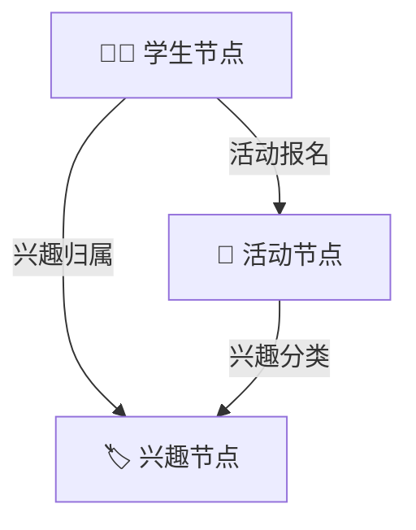
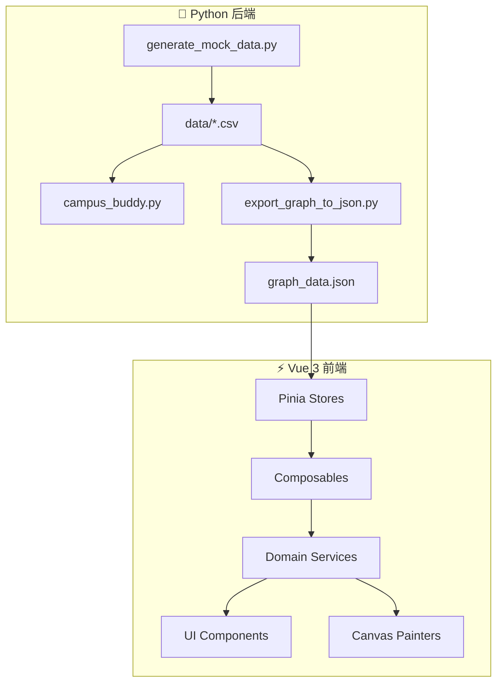

# 🧭 Campus Buddy v4.0.0 — 校园社交拓扑网络与智能匹配系统

> 🌐 **在线演示**: [https://bestxby.github.io/Campus-Buddy/](https://bestxby.github.io/Campus-Buddy/)
>
> 🧪 **测试覆盖率**: 70/70 前端 Vitest 通过 · 23/23 后端 Pytest 通过 · Vue-tsc 编译零报错

`Campus Buddy` 是一个基于**图数据结构**的高性能校园社交与活动匹配推荐系统。支持 **1,500+ 学生、30+ 种兴趣标签、100 个校园活动**的大规模数据关联，提供命令行 MVP 工具与基于 **Vue 3 + D3.js + TypeScript** 开发的现代化可视化 Web 交互面板。

项目完全适配 **GitHub Pages 静态托管**，前端采用**模块化面向对象领域服务架构**，提供 60FPS 丝滑的拓扑图与邻接矩阵交互体验。

---

## ✨ 核心功能

### 🎓 学生端

| 功能 | 说明 |
|------|------|
| **智能活动推荐** | 基于双跳 BFS 路径穿透 + Jaccard 相似度，按兴趣匹配度排序推荐校园活动 |
| **搭子匹配** | 自动寻找拥有共同兴趣的同学，按 Jaccard 系数降序排列，量化兴趣重合度 |
| **社交画像** | 登录时选择兴趣标签，系统自动生成社交画像（运动健将 / 文艺青年 / 科技极客 / 社交达人 / 斜杠青年） |
| **隐私模式** | 开启后不被推荐给他人，BFS 寻路自动绕道保护 |
| **达人模式** | 开启后获得 1.3× 相似度加成，优先被推荐给有共同兴趣的同学 |
| **多格式报告导出** | 支持 Markdown / 离线 HTML / PDF / PNG 海报四种格式一键导出个性化匹配报告 |
| **活动报名** | 浏览全部活动，一键报名，状态实时同步到推荐系统 |

### 🔧 管理员端

| 功能 | 说明 |
|------|------|
| **邻接矩阵分析** | 学生×兴趣、兴趣×兴趣共现、学生×活动三种维度的全屏交互式矩阵 |
| **社群划分** | 基于连通分量算法自动识别独立社群圈子，环形图可视化展示 |
| **中心性分析** | 度中心性（社交达人）与介数中心性（跨界桥梁）实时计算 |
| **孤立学生诊断** | 自动检测社交孤立学生，提供兴趣圈 / 社交达人 / 热门活动三种桥接方案 |
| **活动管理** | 发布新活动、创建新兴趣标签，支持定向推广 |
| **系统日志** | 实时记录所有操作与网络变化 |

---

## 🧠 算法架构

本项目的核心是一个**异构无向图（Heterogeneous Undirected Graph）**：



### 核心算法

| 算法 | 复杂度 | 说明 |
|------|--------|------|
| **双跳 BFS 推荐** | O(V+E) | `Student → Interest → Activity`，返回去重并按热度排序的推荐活动 |
| **Jaccard 相似度** | O(n·m) | $J(A,B) = \frac{\|I_A \cap I_B\|}{\|I_A \cup I_B\|}$，量化两人兴趣重合度 |
| **领域级兜底推荐** | O(V) | 当新兴趣标签无人选定时，按归属领域（运动/艺术/科技/社交）匹配推荐 |
| **BFS 最短路径** | O(V+E) | parent-map 回溯法，支持隐私过滤绕道 |
| **连通分量** | O(V+E) | BFS 遍历识别极大连通子图 |
| **度中心性** | O(V) | 统计节点关联边数 |
| **介数中心性** | O(V·E) | 统计最短路径通过频次 |
| **社交达人加成** | O(1) | Jaccard × 1.3，上限 1.0 |

---

## 🏗️ 软件架构



**架构分层：**
- **Stores (Pinia)**: 状态管理 — `graph.ts` / `auth.ts` / `recommendation.ts` / `log.ts`
- **Composables**: Facade 外观适配层，隔离响应式 ref 与底层 Service
- **Services**: OOP 领域服务 — 物理引擎、矩阵渲染、数据分析
- **Utils**: 无状态纯函数 — 图论算法、报告生成、Canvas 海报
- **Components**: Vue 纯渲染组件层

---

## 🛠️ 技术栈

| 层级 | 技术 |
|------|------|
| **前端框架** | Vue 3 + TypeScript + Vite 8 |
| **状态管理** | Pinia 3 |
| **图可视化** | D3.js 7 (力导向仿真 + 四叉树空间分割) |
| **数据持久化** | IndexedDB (异步事务) |
| **测试** | Vitest + Vue Test Utils + Pytest |
| **后端** | Python 3.11 (数据生成 + 算法验证) |
| **部署** | GitHub Pages + GitHub Actions CI/CD |
| **设计系统** | Slate & Neon 双主题 (亮色 / 暗色) |

---

## ⚡ 性能优化

| 优化项 | 说明 |
|--------|------|
| **四叉树命中检测** | d3.quadtree 空间分割，hover/拖拽检测 O(N) → O(log N) |
| **IndexedDB 持久化** | 异步事务替代 localStorage 同步阻塞，支持大数据量 |
| **Ego Network 局部子图** | 仅渲染 2 跳范围 15~35 个节点，避免全局 1500+ 节点卡顿 |
| **LOD 文字剔除** | 根据缩放比例自动隐藏过小标签，减少 Canvas 重绘开销 |
| **Session 随机种子** | 页面级稳定种子，刷新不跳变，重置时更新 |
| **SVG 矢量报告** | 离线 HTML 报告用 SVG 替代 Canvas，支持无损缩放 |
| **双向触控滚动** | 邻接矩阵支持 X/Y 双向 Touch Pan + Shift+Wheel 横向滚动 |

---

## 🚀 快速开始

### 环境要求

- **Python 3.8+**
- **Node.js 18+** 与 **npm**

### 1. 生成模拟数据

```bash
# 生成 1500+ 学生的 CSV 数据
python generate_mock_data.py

# 导出为前端 JSON 数据库
python export_graph_to_json.py
```

### 2. 运行 Python 端

```bash
# 命令行演示
python demo_runner.py

# 交互式查询系统
python interactive_app.py

# 单元测试
pytest test_campus_buddy.py
```

### 3. 运行前端

```bash
cd frontend

# 安装依赖
npm install

# 启动开发服务器
npm run dev

# 运行测试
npm run test run

# 构建部署
npm run build
```

---

## 📁 项目结构

```
Campus-Buddy/
├── data/                              # CSV 数据集
├── campus_buddy.py                    # Python 核心图算法
├── generate_mock_data.py              # Mock 数据生成器
├── export_graph_to_json.py            # JSON 导出器
├── test_campus_buddy.py               # Pytest 单元测试
├── requirements.txt                   # Python 依赖
└── frontend/                          # Vue 3 前端
    ├── src/
    │   ├── stores/                    # Pinia 状态管理
    │   ├── composables/               # Facade 适配层
    │   ├── services/                  # OOP 领域服务 & Canvas 渲染器
    │   ├── utils/                     # 纯函数算法 & 工具
    │   ├── components/                # Vue UI 组件
    │   │   ├── admin/                 # 管理员诊断卡片
    │   │   ├── auth/                  # 登录认证组件
    │   │   ├── graph/                 # 拓扑图控制组件
    │   │   └── sidebar/               # 侧边栏子模块
    │   ├── constants/                 # 常量定义
    │   ├── types/                     # TypeScript 类型
    │   ├── style.css                  # 全局设计系统
    │   └── App.vue                    # 根组件
    └── public/
        └── graph_data.json            # 静态图数据库
```

---

## 🖥️ 功能一览

### 登录与画像
- 沉浸式 3 秒三段式加载动画（头像弹出 → 标签飞入 → 图谱生长）
- 五大社交画像自动判定（运动健将 / 文艺青年 / 科技极客 / 社交达人 / 斜杠青年）
- 隐私模式与达人模式互斥切换

### 拓扑图
- D3.js 力导向仿真，支持拖拽、缩放、平移
- 全屏模式下支持 BFS 六度人脉寻路高亮
- 邻接矩阵三种维度切换（学生×兴趣 / 兴趣×兴趣 / 学生×活动）

### 管理员看板
- 3×3 网格仪表盘，实时网络指标诊断
- 孤立学生一键桥接方案（兴趣圈 / 社交达人 / 热门活动）
- 冷门活动定向推广、破冰活动置顶推荐

### 报告导出
- Markdown / HTML / PDF / PNG 四种格式
- HTML 报告集成 SVG 矢量交互图谱
- Canvas 海报生成极客风格分享图

---

## 📋 版本历史

| 版本 | 日期 | 主要更新 |
|------|------|----------|
| **v4.0.0** | 2026-05-31 | 全主题适配修复、领域级兜底推荐、UI/UX 全面优化 |
| v3.0.0 | 2026-05-30 | IndexedDB 持久化、SVG 交互报告、四叉树 Canvas 优化 |
| v2.1.0 | 2026-05-29 | 视觉打磨、Emoji 矢量化、布局间距对齐 |
| v2.0.0 | 2026-05-29 | 管理员诊断后台、邻接矩阵、中心性分析 |
| v1.1.0 | 2026-05-28 | 加载动画、性能重构 |
| v1.0.0 | 2026-05-28 | 初始稳定版发布 |

---

## 📄 开源协议

MIT License © [bestxby](https://github.com/bestxby)
