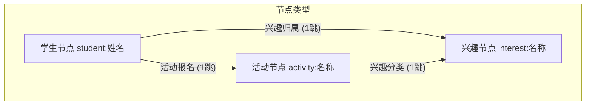

# 🧭 Campus Buddy: 校园社交拓扑网络与智能匹配系统

> 🌐 **在线体验**: [https://bestxby.github.io/Campus-Buddy/](https://bestxby.github.io/Campus-Buddy/)

`Campus Buddy` 是一个基于图数据结构（Graph Data Structure）的高性能校园社交与活动匹配推荐系统。本项目支持 **1,500+ 学生、30 种兴趣标签、100 个校园活动**的大规模数据关联，提供命令行 MVP 工具与基于 **Vue 3 + D3.js + TypeScript** 开发的极客霓虹感（Sleek Slate & Neon）现代化可视化 Web 交互面板。

项目完全适配 **GitHub Pages 静态托管**，前端采用**面向对象领域服务架构**（OOP Domain Services + Facade Composables），管理员登录使用 **SHA-256 客户端哈希校验**确保安全。

---

## 📖 设计思路与算法架构

本项目的核心是一个**异构无向图（Heterogeneous Undirected Graph）**。在普通的同构图中，节点类型单一（如全是人）。而在 `Campus Buddy` 中，图的节点分为三种类型，通过不同的关联边编织成网：



### 1. 核心图算法设计

* **双跳路径穿透推荐（2-Hop BFS Recommendations）**：
  * **活动匹配**：从给定学生节点出发，搜索其关联的所有兴趣节点（1跳），再由兴趣节点搜索关联的所有校园活动（2跳）。其路径为 `Student -> Interest -> Activity`，返回去重并按字母排序的推荐活动列表。
  * **搭子匹配**：同样通过两步搜索，寻找拥有共同兴趣的其他同学：`Student -> Interest -> Other Student`，排除学生自身。
* **Jaccard 相似度搭子排序（Jaccard Similarity Ranking）**：
  * 对搭子匹配结果按 Jaccard 系数降序排列，量化两人兴趣圈的重合程度：
    $$J(A, B) = \frac{|Interests_A \cap Interests_B|}{|Interests_A \cup Interests_B|}$$
  * 分数越高表示兴趣重合度越大，前端展示每位搭子的共享兴趣标签和匹配度百分比。
* **BFS 最短路径查找（Shortest Path via BFS）**：
  * 实现了任意两个学生节点之间的 BFS 最短路径搜索（使用 **parent-map 回溯法**，内存复杂度 O(V)），展示"六度分隔"式的跨兴趣圈人脉路径。路径结果在 D3.js 拓扑图中以高亮连线可视化。
* **社交路径穿透（协同过滤式匹配理由）**：
  * 为了避免单一的"根据兴趣推活动"显得生硬、勉强，系统实现了社交协同匹配：
    $$Path(S \to I \to S' \to A)$$
    如果你的活动搭子（共享兴趣的同学 $S'$）已经报名了活动 $A$，系统会在活动卡片上展示友情提示：`👥 搭子情况: 小刚 等人也报名了该活动`。这种 3-Hop 的深度关联大大提升了社交推荐的自然度与真实感。
* **连通社区划分（Connected Components using BFS）**：
  * 系统使用广度优先搜索（BFS）算法遍历全图，识别出图中的所有极大连通子图（即相互独立、没有交集的兴趣小圈子）。这有助于学校管理员分析校园社交孤岛，优化活动资源分配。

### 2. 纯前端图仿真设计 (GitHub Pages 适配)
* 传统的 Web 应用通常将图存储在后端数据库（如 Neo4j），但为了实现**零服务器运维、即开即用的静态页面部署（GitHub Pages）**，本项目将图的创建、BFS 双跳算法以及连通圈计算**完整移植到了前端 JavaScript (TypeScript)**。
* 启动时，前端会加载通过 Python 编译的静态 JSON 数据库 `graph_data.json`；当用户进行"模拟登入"或"沙盒调试"时，新生成的节点与边将保存在浏览器本地（`localStorage`）中，实现无后端的实时增量仿真。

### 3. 可视化性能优化 (Focal Subgraph)
* **面临挑战**：直接在网页 SVG 中用 D3.js 力导向图渲染 1,500+ 个节点和近千条边，会导致浏览器发生严重卡顿甚至崩溃。
* **解决方案**：引入 **Ego Network（自我聚焦子图）** 概念。
  * 当未选择特定学生时，仅展示核心的兴趣圈概览图。
  * 当选中某个学生时，D3 引擎仅抓取该生周围的 **2跳聚焦子图**（包含该学生、其选择的兴趣、这些兴趣关联的活动以及几位核心搭子），节点数量控制在 15~35 个。
  * 同时，将搭子的报名关系绘制为**橙色虚线**，将当前用户的直连报名绘制为**绿色实线**，确保 60FPS 丝滑的拖拽与缩放体验。

---

## 🏗️ 软件架构设计

本项目经历了从"平铺散落逻辑"到**严格分层面向对象架构**的重构，遵循以下原则：

```
Page → Module → Component → Service → Model
（禁止跨层调用，禁止在 UI 层写业务逻辑）
```

### 分层结构

| 层级 | 角色 | 关键文件 |
|------|------|----------|
| **Model** | 类型定义与常量 | `types/index.ts`, `constants/interests.ts` |
| **Service** | 单例领域对象，持有状态与算法 | `services/GraphService.ts`, `AuthService.ts`, `GraphAnalyticsService.ts`, `RecommendationService.ts` |
| **Composable** | 轻量 Facade/Adapter，暴露响应式引用给 UI | `composables/useGraph.ts`, `useAuth.ts`, `useRecommendations.ts` |
| **Component** | 纯 UI 展示，调用 Composable，不写业务逻辑 | `components/**/*.vue` |

### 设计模式
- **Singleton**：每个 Service 类通过 `getInstance()` 确保全局唯一实例
- **Observer / Callback**：`GraphService.registerOnStatsUpdate()` 解耦图更新与分析计算（避免循环依赖）
- **Facade**：Composables 层作为 Services 的薄层适配器，隔离 UI 与业务逻辑

---

## ⚡ 性能优化亮点

| 优化项 | 手段 | 收益 |
|--------|------|------|
| 主线程长任务 | `setTimeout(0)` 异步化图分析批次 | 消除首屏 50–150ms 阻塞 |
| O(n²) 邻居检测 | Set 哈希小集合迭代替换双重循环 | 破冰算法提速数倍 |
| BFS 内存开销 | parent-map 回溯法替换数组展开 | 内存从 O(V·L) 降至 O(V) |
| 重复数组分配 | `for-of` 直接迭代 Set，消除 `Array.from()` | 减少 GC 压力 |
| D3 仿真收敛 | `alphaDecay=0.028, velocityDecay=0.45` | tick 总数减少约 20% |
| 首屏 JS 体积 | Vite `manualChunks` 分割 d3 为独立 chunk | d3 可被浏览器长期缓存 |

---

## 📁 项目文件结构

```bash
week13_campus_buddy/
├── .gitignore
├── README.md
├── campus_buddy.py               # Python 算法核心（BFS / Jaccard / 最短路径 / 连通分量）
├── demo_runner.py                # Python 经典 MVP 演示入口（控制台输出）
├── interactive_app.py            # Python 命令行交互式数据检索系统
├── test_campus_buddy.py          # Pytest 单元测试（12 个用例，含性能基准 < 5ms）
├── generate_mock_data.py         # 模拟数据生成器（1500 学生 × 30 兴趣 × 100 活动）
├── export_graph_to_json.py       # 数据导出器（CSV → 前端 JSON 数据库）
└── frontend/                     # Vue 3 + TypeScript 分层前端
    ├── public/
    │   └── graph_data.json       # 供前端加载的静态图数据（347KB）
    ├── src/
    │   ├── App.vue               # 主布局编排（侧边栏 + 内容区 + 图弹窗）
    │   ├── main.ts               # 项目入口
    │   ├── style.css             # 全局 CSS 设计系统（Dark Neon 变量 + 工具类 + 全局 Tooltip）
    │   ├── types/index.ts        # TypeScript 类型定义
    │   ├── constants/interests.ts # 兴趣分类常量表
    │   │
    │   ├── services/             # 【Service 层】单例领域对象（持有状态与算法）
    │   │   ├── GraphService.ts          # 图结构 CRUD、BFS 最短路径、图数据加载
    │   │   ├── GraphAnalyticsService.ts # 度中心性、介数中心性、孤立诊断、破冰潜力
    │   │   ├── RecommendationService.ts # 2-Hop 推荐、Jaccard 排序、好友搜索
    │   │   ├── AuthService.ts           # 用户认证、会话持久化、SHA-256 校验
    │   │   ├── LogService.ts            # 操作日志记录
    │   │   ├── ForceGraphRenderer.ts    # D3.js 力导向图渲染器
    │   │   ├── ForceGraphDataBuilder.ts # 图数据过滤与节点/边构建
    │   │   └── ForceGraphTooltipHelper.ts # 节点悬停信息生成
    │   │
    │   ├── composables/          # 【Composable 层】轻量 Facade，暴露响应式引用
    │   │   ├── useAuth.ts
    │   │   ├── useGraph.ts
    │   │   ├── useRecommendations.ts
    │   │   ├── useGraphInsights.ts
    │   │   └── useLogs.ts
    │   │
    │   └── components/           # 【Component 层】纯 UI 展示组件
    │       ├── LoginOverlay.vue         # 登录注册覆盖层（含动画流程编排）
    │       ├── AppSidebar.vue           # 侧边栏容器
    │       ├── AdminDashboard.vue       # 管理员看板容器
    │       ├── ActivityList.vue         # 活动推荐列表
    │       ├── BuddyList.vue            # 搭子推荐列表
    │       ├── GraphModal.vue           # D3 全屏拓扑图弹窗
    │       ├── GraphModal.css           # 拓扑图弹窗专属样式
    │       ├── SearchHeader.vue         # 管理员学生搜索栏
    │       ├── auth/
    │       │   ├── StudentLoginForm.vue # 学生登录表单（兴趣多选 + 实时画像预览）
    │       │   ├── AdminLoginForm.vue   # 管理员密码登录
    │       │   └── LoginLoadingScreen.vue # 登录过渡动画（三段式图谱接入 Loading）
    │       ├── sidebar/
    │       │   ├── SidebarProfile.vue   # 用户画像卡片
    │       │   ├── SidebarStats.vue     # 全局图统计数字
    │       │   ├── SidebarAdminControl.vue # 管理员搜索与操作控制
    │       │   └── SidebarTimeline.vue  # 学生已报名活动时间线
    │       ├── admin/
    │       │   ├── AdminHeader.vue              # 管理员看板标题栏
    │       │   ├── DegreeCentralityCard.vue     # 社交达人排行（度中心性）
    │       │   ├── BetweennessCentralityCard.vue # 桥接人排行（介数中心性）
    │       │   ├── PopularInterestsCard.vue     # 热门兴趣标签排行
    │       │   ├── IsolationCard.vue            # 社交孤立诊断
    │       │   ├── BridgePlanPanel.vue          # 一键人脉桥接方案面板
    │       │   ├── ActivitySaturationCard.vue   # 活动热度与宣传推广
    │       │   ├── ActivityPromoPanel.vue       # 活动定向邀请面板
    │       │   ├── IcebreakingPotentialCard.vue # 活动破冰潜力排行
    │       │   └── SystemLogsCard.vue           # 系统操作日志
    │       └── buddy/
    │           └── BuddyCard.vue        # 搭子卡片
    ├── package.json
    ├── vite.config.ts            # Vite 构建（d3 独立 chunk 分割）
    ├── tsconfig.json
    └── tsconfig.node.json
```

---

## 🛠️ 使用手册 & 运行指南

### 前置条件
确保您的系统安装了以下环境：
* **Python 3.8+** (推荐安装 `pytest` 进行测试)
* **Node.js 18+** 与 **npm** (用于运行网页端)

---

### 第一步：克隆并生成大规模图数据
在项目根目录下打开终端，依次运行 Python 脚本生成 1,500+ 学生规模的模拟数据集，并导出为 JSON：

```bash
# 1. 生成 1500 名学生、30 个兴趣分类、100 个校园活动、1515 条报名边的模拟 CSV 数据
python generate_mock_data.py

# 2. 将 CSV 数据打包并导出为前端可加载的静态 JSON 数据库
python export_graph_to_json.py
```

*生成成功后，会在项目下创建 `data/` 目录，并在 `frontend/public/` 下生成 `graph_data.json`。*

---

### 第二步：运行 Python 端演示与测试
如果您想在控制台验证图算法的正确性：

```bash
# 1. 运行经典的图遍历路径输出演示
python demo_runner.py

# 2. 启动命令行下的交互式Campus Buddy查询系统
python interactive_app.py

# 3. 运行自动化单元测试（验证 BFS 逻辑、命名防冲突，以及极限规模下的算法延迟检测）
pytest test_campus_buddy.py
```

*极限性能测试会检测 2 跳推荐的响应时间，在 1,500+ 节点网络中，单次图查询延迟严格小于 **5毫秒**。*

---

### 第三步：启动 Vue 3 霓虹网页端
进入前端目录，安装依赖并启动本地开发服务器：

```bash
# 进入前端文件夹
cd frontend

# 安装 D3.js、Vue 3 和 Vite 等依赖
npm install

# 启动本地开发服务器
npm run dev

# 或构建生产版本预览
npm run preview
```

在浏览器中打开命令行提示的地址（默认 `http://localhost:5173`），即可进入交互系统。

---

## 🖥️ 网页端交互与功能指南

1. **沉浸式登录过渡动画**
   * 学生填写姓名、选择头像和兴趣标签后，点击「生成社交画像并登入系统」。
   * 系统播放约 **3 秒的三段式动画**：头像弹出 → 兴趣标签从四面飞入 → 图谱连接线向外生长，最终以极光扫过全屏的效果进入主界面。

2. **模拟登入与画像构建 (Mock Login & Survey)**
   * 输入您的姓名，在下方**折叠面板中自主勾选**您的兴趣爱好（支持多选，分运动、艺术、技术、社交四大类）。
   * 管理员登录支持 **SHA-256 客户端哈希校验**，密码永不以明文存储。

3. **分类与按需展示推荐 (Interest Filter Tabs)**
   * 系统顶端会显示您个人的兴趣标签栏（例如：`🌟 全部推荐`、`机器学习`、`羽毛球`）。
   * **折叠限制**：为了防止活动列表刷屏，每个兴趣模块默认只展示 **3 个最佳匹配活动**，点击展开可查看全部，点击「一键报名」可即时参与并更新主页卡片。

4. **Jaccard 搭子匹配排序 (Buddy Ranking)**
   * 搭子推荐面板按 Jaccard 相似度降序排列，展示每位同学的共享兴趣数量和匹配度百分比。
   * 支持实时搜索过滤，可快速定位特定同学。

5. **管理员大数据看板 (Admin Dashboard)**
   * **度中心性 / 介数中心性**：发现校园社交达人与关键桥接人。
   * **社交孤立诊断**：检测度数为 0 的孤立学生，提供一键桥接方案。
   * **活动热度统计**：展示所有活动报名人数，标注冷门活动并支持定向邀请。
   * **破冰潜力排行**：评估各活动连接不同兴趣圈学生的潜在破冰效果，支持置顶推荐。
   * **热门兴趣标签排行**：全校兴趣标签学生覆盖数可滚动展示。
   * **系统操作日志**：实时记录管理员所有操作行为。

6. **D3.js 全屏力导向拓扑网络 (Interactive Canvas)**
   * 鼠标滚动：支持关系网的无限缩放与平移。
   * 节点拖拽：拖拽任意节点可看清与其他关联边的张力。
   * 最短路径查找：输入两个学生姓名即可高亮显示跨兴趣圈的人脉路径（BFS parent-map 算法）。
   * 管理员模式下可点击节点无缝切换查询视角。

---

## 🔧 技术栈

| 层级 | 技术 |
|---|---|
| 前端框架 | Vue 3 (Composition API) + TypeScript |
| 架构模式 | OOP Domain Services + Facade Composables + SFC Components |
| 构建工具 | Vite 5（d3 vendor chunk 分割） |
| 可视化 | D3.js v7 (Force-Directed Graph) |
| 样式系统 | Vanilla CSS (Dark Neon 设计系统，全局 Tooltip 系统) |
| 后端算法 | Python 3 (BFS / Jaccard / Connected Components) |
| 测试 | Pytest (12 用例 + 性能基准) |
| 部署 | GitHub Pages (gh-pages 分支) |
| 安全 | Web Crypto API (SHA-256 哈希) |


---

## 📖 设计思路与算法架构

本项目的核心是一个**异构无向图（Heterogeneous Undirected Graph）**。在普通的同构图中，节点类型单一（如全是人）。而在 `Campus Buddy` 中，图的节点分为三种类型，通过不同的关联边编织成网：


### 1. 核心图算法设计

* **双跳路径穿透推荐（2-Hop BFS Recommendations）**：
  * **活动匹配**：从给定学生节点出发，搜索其关联的所有兴趣节点（1跳），再由兴趣节点搜索关联的所有校园活动（2跳）。其路径为 `Student -> Interest -> Activity`，返回去重并按字母排序的推荐活动列表。
  * **搭子匹配**：同样通过两步搜索，寻找拥有共同兴趣的其他同学：`Student -> Interest -> Other Student`，排除学生自身。
* **Jaccard 相似度搭子排序（Jaccard Similarity Ranking）**：
  * 对搭子匹配结果按 Jaccard 系数降序排列，量化两人兴趣圈的重合程度：
    $$J(A, B) = \frac{|Interests_A \cap Interests_B|}{|Interests_A \cup Interests_B|}$$
  * 分数越高表示兴趣重合度越大，前端展示每位搭子的共享兴趣标签和匹配度百分比。
* **BFS 最短路径查找（Shortest Path via BFS）**：
  * 实现了任意两个学生节点之间的 BFS 最短路径搜索，展示"六度分隔"式的跨兴趣圈人脉路径。路径结果在 D3.js 拓扑图中以高亮连线可视化。
* **社交路径穿透（协同过滤式匹配理由）**：
  * 为了避免单一的“根据兴趣推活动”显得生硬、勉强，系统实现了社交协同匹配：
    $$Path(S \to I \to S' \to A)$$
    如果你的活动搭子（共享兴趣的同学 $S'$）已经报名了活动 $A$，系统会在活动卡片上展示友情提示：`👥 搭子情况: 小刚 等人也报名了该活动`。这种 3-Hop 的深度关联大大提升了社交推荐的自然度与真实感。
* **连通社区划分（Connected Components using BFS）**：
  * 系统使用广度优先搜索（BFS）算法遍历全图，识别出图中的所有极大连通子图（即相互独立、没有交集的兴趣小圈子）。这有助于学校管理员分析校园社交孤岛，优化活动资源分配。

### 2. 纯前端图仿真设计 (GitHub Pages 适配)
* 传统的 Web 应用通常将图存储在后端数据库（如 Neo4j），但为了实现**零服务器运维、即开即用的静态页面部署（GitHub Pages）**，本项目将图的创建、BFS 双跳算法以及连通圈计算**完整移植到了前端 JavaScript (TypeScript)**。
* 启动时，前端会加载通过 Python 编译的静态 JSON 数据库 `graph_data.json`；当用户进行“模拟登入”或“沙盒调试”时，新生成的节点与边将保存在浏览器本地（`localStorage`）中，实现无后端的实时增量仿真。

### 3. 可视化性能优化 (Focal Subgraph)
* **面临挑战**：直接在网页 SVG 中用 D3.js 力导向图渲染 1,500+ 个节点和近千条边，会导致浏览器发生严重卡顿甚至崩溃。
* **解决方案**：引入 **Ego Network（自我聚焦子图）** 概念。
  * 当未选择特定学生时，仅展示核心的兴趣圈概览图。
  * 当选中某个学生时，D3 引擎仅抓取该生周围的 **2跳聚焦子图**（包含该学生、其选择 of 2-4 个兴趣、这些兴趣关联的活动以及几位核心搭子），节点数量控制在 15~35 个。
  * 同时，将搭子的报名关系绘制为**紫色虚线**，将当前用户的一键报名绘制为**青色实线**，确保 60FPS 丝滑的拖拽与缩放体验。

---

## 📁 项目文件结构

```bash
week13_campus_buddy/
├── .gitignore                    # Git 忽略文件
├── README.md                     # 本说明文档
├── campus_buddy.py               # Python 算法核心（BFS / Jaccard / 最短路径 / 连通分量）
├── demo_runner.py                # Python 经典 MVP 演示入口（控制台输出）
├── interactive_app.py            # Python 命令行交互式数据检索系统
├── test_campus_buddy.py          # Pytest 单元测试（12 个用例，含性能基准 < 5ms）
├── generate_mock_data.py         # 模拟数据生成器（1500 学生 × 30 兴趣 × 100 活动）
├── export_graph_to_json.py       # 数据导出器（CSV → 前端 JSON 数据库）
└── frontend/                     # Vue 3 + TypeScript 模块化前端
    ├── public/
    │   └── graph_data.json       # 供前端加载的静态图数据
    ├── src/
    │   ├── App.vue               # 主布局（侧边栏 + 内容区 + 图弹窗编排）
    │   ├── main.ts               # 项目入口
    │   ├── style.css             # 全局 Slate & Neon 霓虹渐变 CSS 设计系统
    │   ├── components/           # 模块化 Vue 单文件组件
    │   │   ├── LoginOverlay.vue  #   登录注册覆盖层（SHA-256 管理员验证）
    │   │   ├── AppSidebar.vue    #   个人画像 + 统计面板 + 活动时间线侧边栏
    │   │   ├── SearchHeader.vue  #   管理员学生搜索栏（自动补全）
    │   │   ├── ActivityList.vue  #   活动推荐列表（兴趣分组 + 展开/收起）
    │   │   ├── BuddyList.vue     #   搭子推荐列表（Jaccard 排序 + 实时搜索）
    │   │   └── GraphModal.vue    #   D3.js 力导向全屏拓扑图弹窗（最短路径高亮）
    │   ├── composables/          # 可组合逻辑层（Composition API）
    │   │   ├── useAuth.ts        #   认证逻辑（SHA-256 哈希 + 会话持久化）
    │   │   ├── useGraph.ts       #   图数据管理（加载 / 构建 / 统计）
    │   │   ├── useRecommendations.ts  # 推荐算法（2-Hop BFS / Jaccard / 搜索 / 过滤）
    │   │   └── useGraphInsights.ts    # 图洞察分析（连通分量 / 度分布）
    │   ├── types/index.ts        # TypeScript 类型定义
    │   └── constants/interests.ts # 兴趣分类常量表（运动/艺术/技术/社交）
    ├── package.json              # 依赖与脚本（含 gh-pages 一键部署）
    ├── vite.config.ts            # Vite 构建配置（base 路径适配 GitHub Pages）
    ├── tsconfig.json             # TypeScript 配置
    └── tsconfig.node.json        # Node 端 TypeScript 配置
```

---

## 🛠️ 使用手册 & 运行指南

### 前置条件
确保您的系统安装了以下环境：
* **Python 3.8+** (推荐安装 `pytest` 进行测试)
* **Node.js 18+** 与 **npm** (用于运行网页端)

---

### 第一步：克隆并生成大规模图数据
在项目根目录下打开终端，依次运行 Python 脚本生成 1,500+ 学生规模的模拟数据集，并导出为 JSON：

```bash
# 1. 生成 1500 名学生、30 个兴趣分类、100 个校园活动、1515 条报名边的模拟 CSV 数据
python generate_mock_data.py

# 2. 将 CSV 数据打包并导出为前端可加载的静态 JSON 数据库
python export_graph_to_json.py
```

*生成成功后，会在项目下创建 `data/` 目录，并在 `frontend/public/` 下生成 `graph_data.json`。*

---

### 第二步：运行 Python 端演示与测试
如果您想在控制台验证图算法的正确性：

```bash
# 1. 运行经典的图遍历路径输出演示
python demo_runner.py

# 2. 启动命令行下的交互式Campus Buddy查询系统
python interactive_app.py

# 3. 运行自动化单元测试（验证 BFS 逻辑、命名防冲突，以及极限规模下的算法延迟检测）
pytest test_campus_buddy.py
```

*极限性能测试会检测 2 跳推荐的响应时间，在 1,500+ 节点网络中，单次图查询延迟严格小于 **5毫秒**。*

---

### 第三步：启动 Vue 3 霓虹网页端
进入前端目录，安装依赖并启动本地开发服务器：

```bash
# 进入前端文件夹
cd frontend

# 安装 D3.js、Vue 3 和 Vite 等依赖
npm install

# 启动本地预览服务器 (默认端口 http://localhost:4173)
npm run preview
```

在浏览器中打开命令行提示的地址（如 `http://localhost:4173` 或控制台给出的端口），即可进入交互系统。

---

## 🖥️ 网页端交互与功能指南

1. **模拟登入与画像构建 (Mock Login & Survey)**
   * 启动网页后，会弹出一个黑客暗色霓虹风格的登录卡片。
   * 输入您的姓名（如：`张伟`），并在下方**折叠面板中自主勾选**您的兴趣爱好（支持多选，分运动、艺术、技术、社交四大类）。
   * 点击 `生成画像并登入`，系统会即时将您的数据写入到拓扑网络中，并自动计算出您在当前网络中的位置。
   * 管理员登录支持 **SHA-256 客户端哈希校验**，密码永不以明文存储。
2. **分类与按需展示推荐 (Interest Filter Tabs)**
   * 系统顶端会显示您个人的兴趣标签栏（例如：`🌟 全部推荐`、`机器学习`、`羽毛球`）。
   * **自主选择**：点击不同的标签，下方的匹配推荐会即时响应过滤，避免信息过载。
   * **折叠限制**：为了防止活动列表刷屏，每个兴趣模块默认只展示 **3 个最佳匹配活动**。点击 `+ 展开其余活动` 可滑动查看全部，点击 `一键报名` 可即时参与并更新主页卡片。
3. **Jaccard 搭子匹配排序 (Buddy Ranking)**
   * 搭子推荐面板按 Jaccard 相似度降序排列，展示每位同学的共享兴趣数量和匹配百分比。
   * 支持实时搜索过滤，可快速定位特定同学。
4. **社交网络沙盒调试器 (Sandbox Tool)**
   * 在左下角的 **"动态调试网络"** 面板中，您可以随时手动录入新学生或新活动（如注册一个新学生"李雷"喜欢"Go编程"），右侧的 D3 拓扑图与推荐数据会立刻无缝更新。
5. **D3.js 全屏力导向拓扑网络 (Interactive Canvas)**
   * 点击"查看关系网络拓扑图"按钮打开全屏图弹窗。
   * 鼠标滚动：支持关系网的无限缩放与平移。
   * 节点拖拽：拖拽任意节点可看清与其他关联边的张力。
   * 最短路径查找：输入两个学生姓名即可高亮显示跨兴趣圈的人脉路径。
   * 管理员模式下可点击节点无缝切换查询视角。

---

## 🔧 技术栈

| 层级 | 技术 |
|---|---|
| 前端框架 | Vue 3 (Composition API) + TypeScript |
| 构建工具 | Vite 5 |
| 可视化 | D3.js v7 (Force-Directed Graph) |
| 样式系统 | Vanilla CSS (Dark Neon 设计系统) |
| 后端算法 | Python 3 (BFS / Jaccard / Connected Components) |
| 测试 | Pytest (12 用例 + 性能基准) |
| 部署 | GitHub Pages (gh-pages 分支) |
| 安全 | Web Crypto API (SHA-256 哈希) |

