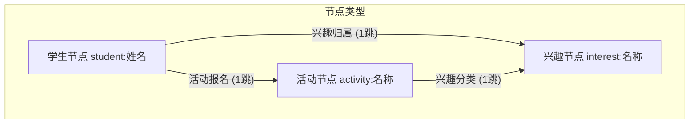

# 🧭 Campus Buddy: 校园社交拓扑网络与智能匹配系统

> 🌐 **在线演示**: [https://bestxby.github.io/Campus-Buddy/](https://bestxby.github.io/Campus-Buddy/)
> 
> 🧪 **测试覆盖率**: 26/26 前端 Vitest 通过, 21/21 后端 Pytest 通过, Vue-tsc 编译 0 报错

`Campus Buddy` 是一个基于图数据结构（Graph Data Structure）的高性能校园社交与活动匹配推荐系统。本项目支持 **1,500+ 学生、30 种兴趣标签、100 个校园活动**的大规模数据关联，提供命令行 MVP 工具与基于 **Vue 3 + D3.js + TypeScript** 开发的极客霓虹感（Sleek Slate & Neon）现代化可视化 Web 交互面板。

项目完全适配 **GitHub Pages 静态托管**，前端采用**模块化面向对象领域服务架构**（OOP Domain Services + Canvas Painter Separation + Facade Composables），提供 60FPS 丝滑的 ego-network 拓扑图与邻接矩阵性能体验。

---

## 📖 设计思路与算法架构

本项目的核心是一个**异构无向图（Heterogeneous Undirected Graph）**。通过将不同类型的实体抽象为节点，并用关联边连接，编织成一张校园人脉关系网络：



### 1. 核心图算法设计

* **双跳路径穿透推荐（2-Hop BFS Recommendations）**：
  * **活动匹配**：从给定学生节点出发，搜索其关联的所有兴趣节点（1跳），再由兴趣节点搜索关联的所有校园活动（2跳）。路径为 `Student -> Interest -> Activity`，返回去重并按报名热度排序的推荐活动。
  * **搭子匹配**：同样通过两步搜索，寻找拥有共同兴趣的其他同学：`Student -> Interest -> Other Student`，排除学生自身。
* **Jaccard 相似度搭子排序（Jaccard Similarity Ranking）**：
  * 对搭子匹配结果按 Jaccard 系数降序排列，量化两人兴趣圈的重合程度：
    $$J(A, B) = \frac{|Interests_A \cap Interests_B|}{|Interests_A \cup Interests_B|}$$
  * **社交特权模式 (Social Boost)**：开启社交达人/社交模式的学生会获得 $1.3\times$ 的相似度加成，上限为数学极限值 `1.0`。该算法确保了即使被 boost 后，原本满分（1.0）的匹配也不会降级，保证了排名的逻辑正确性。
* **BFS 隐私保护最短路径查找（Shortest Path via BFS & Privacy Filter）**：
  * 实现了任意两个学生节点之间的 BFS 最短路径搜索（使用 **parent-map 回溯法**，空间复杂度 $O(V)$），展示跨兴趣圈人脉路径。
  * **隐私过滤**：在寻路过程中，系统在 **TypeScript** 和 **Python** 两端同步实现了严格的**隐私过滤算法**。如果路径中的中间节点包含开启了隐私模式（`isPrivate`）的学生，则会自动绕道或跳过该路径；如果终点学生为隐私模式，则直接拒绝返回路径，从而在算法底层切实保护了用户隐私安全。
* **社区划分与指标分析（Connected Components & Network Metrics）**：
  * **连通社群划分**：使用 BFS 遍历全图，识别出相互独立的极大连通子图（社群圈子），并在前端以美观的环状比例图和信息卡片展示。
  * **网络指标分析**：实时计算网络密度（Density）、聚类系数（Clustering Coefficient）以及平均路径长度（Average Path Length），帮助管理员把控网络健康度。
  * **度中心性与介数中心性**：计算节点的关联度数（Degree Centrality）和最短路径通过频次（Betweenness Centrality），精确诊断出校园社交达人（Influencers）和跨界中介纽带（Bridges）。

---

## 🏗️ 软件架构设计 (OOP Domain Services)

为应对前端业务规模的扩大，系统进行了一次彻底的**架构解耦重构**，从原先的平铺逻辑升级为了面向对象领域服务架构，确保所有组件代码在 **300 行以内**：

```
UI Components (纯 Vue 渲染 & 交互事件触发)
       │
       ▼
Facade Composables (轻量状态适配器，隔离 Vue 响应式 ref)
       │
       ▼
Domain Services / Painters (单例领域服务，管理 Graph 状态与底层 Canvas 绘制逻辑)
       │
       ▼
Pure Utilities / Models (无状态图论算法纯函数 & 基础数据类型定义)
```

1. **Painter 像素渲染器分离**：
   - 将 Canvas 底层的绘图细节提取为独立的 `ForceGraphCanvasPainter` 和 `AdjacencyMatrixPainter`，使 `ForceGraphRenderer` 和 `AdjacencyMatrixRenderer` 只专注于事件监听、D3 Simulation 状态机管理与物理引擎微调。
2. **纯算法函数解耦**：
   - 将所有图论分析算法从 Service 中剥离为 `graph-metrics.ts` 中的 Stateless Pure Functions，方便在无 DOM 依赖下进行单元测试。
3. **样式表分离 (CSS Isolation)**：
   - 将 Vue 单文件组件（SFC）中庞大的样式块抽离成同级的 `.css` 文件，并利用 `<style scoped src="./App.css"></style>` 引入，在降低单个文件行数的同时，保障了样式的局部隔离性。

---

## ⚡ 性能优化与技术亮点

* **局部自我聚焦子图 (Ego Network)**：避免直接在前端绘制包含 1,500+ 节点和千条边的全局大图，当选择特定学生时，仅抓取其 2跳 范围内的聚焦子图（节点数 15~35 个），实现 60FPS 丝滑的拓扑图拖拽和缩放体验。
* **LOD（Level of Detail）视口文字剔除**：在 Canvas 渲染层，根据视口缩放比例自动隐藏过小的文字标签，减少每帧文字绘制的重绘开销。
* **Session 动态随机种子**：在 [stores/graph.ts](file:///e:/学习/大二下课程/数据结构与算法/数据结构大作业/Campus-Buddy/frontend/src/stores/graph.ts) 和 [utils/graph-metrics.ts](file:///e:/学习/大二下课程/数据结构与算法/数据结构大作业/Campus-Buddy/frontend/src/utils/graph-metrics.ts) 中设计了页面级的随机种子：每次页面加载或管理员点击“重置数据”时刷新，但在同一个页面周期内保持稳定。既保证了刷新的新颖性，又杜绝了因局部状态更新导致 UI 拓扑图或指标发生震荡跳变。
* **健壮的节点名解析**：在 [ForceGraphDataBuilder.ts](file:///e:/学习/大二下课程/数据结构与算法/数据结构大作业/Campus-Buddy/frontend/src/services/ForceGraphDataBuilder.ts) 中将提取 subName 的切分方法升级为 substring 机制，即使节点名称本身包含冒号（如 `student:张三:计算机`），也能够完整保留而不被错误截断。
* **全能画像 tie-breaker**：在 [auth-helpers.ts](file:///e:/学习/大二下课程/数据结构与算法/数据结构大作业/Campus-Buddy/frontend/src/utils/auth-helpers.ts) 中优化了画像判定算法，当并列最高兴趣域的数量大于 1 时，返回全新的 **“斜杠青年”**（Slash Youth）角色，彻底消除了原先判定时总是偏向 `tech`（科技极客）维度的程序偏置。
* **无冲突递增 Log ID**：操作日志 ID 生成摒弃了 `Math.random`，改用内部 `idCounter` 递增方式，确保了日志 ID 的唯一性与确定性。

---

## 📁 项目文件结构

```bash
Campus-Buddy/
├── campus_buddy.py               # Python 算法核心（BFS / Jaccard / 最短路径 / 连通分量）
├── demo_runner.py                # Python 经典 MVP 演示入口（控制台输出）
├── interactive_app.py            # Python 命令行交互式数据检索系统
├── test_campus_buddy.py          # Pytest 单元测试（21 个用例，含隐私寻路测试）
├── generate_mock_data.py         # 模拟数据生成器（1500 学生 × 30 兴趣 × 100 活动）
├── export_graph_to_json.py       # 数据导出器（CSV → 前端 JSON 数据库）
└── frontend/                     # Vue 3 + TypeScript 模块化前端
    ├── public/
    │   └── graph_data.json       # 供前端加载的静态图数据
    ├── src/
    │   ├── App.vue               # 主布局编排
    │   ├── App.css               # 主布局样式
    │   ├── main.ts               # 项目入口
    │   ├── style.css             # 全局 Slate & Neon 霓虹 CSS 设计系统
    │   ├── types/index.ts        # TypeScript 类型定义
    │   ├── constants/interests.ts # 兴趣分类常量表
    │   │
    │   ├── services/             # 【Service 领域服务与渲染层】
    │   │   ├── ForceGraphRenderer.ts    # D3.js 仿真状态机
    │   │   ├── ForceGraphCanvasPainter.ts # [NEW] Canvas 图绘图实现类
    │   │   ├── ForceGraphDataBuilder.ts # 图数据清洗与 Ego 网过滤
    │   │   ├── AdjacencyMatrixRenderer.ts # 邻接矩阵事件管理器
    │   │   └── AdjacencyMatrixPainter.ts  # [NEW] 邻接矩阵绘图实现类
    │   │
    │   ├── stores/               # 【Pinia 状态存储层】
    │   │   ├── graph.ts          # 图存储、数据增量仿真、随机种子
    │   │   ├── auth.ts           # 用户登录与隐私状态
    │   │   ├── recommendation.ts # 推荐算法执行结果
    │   │   └── log.ts            # 单调递增 Log 存储
    │   │
    │   ├── composables/          # 【Composable 外观适配层】
    │   │   ├── useGraph.ts       
    │   │   ├── useAuth.ts        
    │   │   └── useRecommendations.ts  
    │   │
    │   └── components/           # 【Component UI 渲染层】
    │       ├── AdminDashboard.vue       # 管理员看板（日志、指标、中心性）
    │       ├── AppSidebar.vue           # 个人画像与统计侧边栏
    │       └── GraphModal.vue           # 全屏拓扑关系网弹窗
```

---

## 🛠️ 使用手册 & 运行指南

### 前置条件
确保您的系统安装了以下环境：
* **Python 3.8+** (推荐安装 `pytest` 进行测试)
* **Node.js 18+** 与 **npm** (用于运行网页端)

---

### 第一步：生成大规模图数据
在项目根目录下打开终端，运行脚本生成 1,500+ 学生规模的模拟数据集，并导出为 JSON：

```bash
# 1. 生成模拟 CSV 数据
python generate_mock_data.py

# 2. 将 CSV 数据打包并导出为前端可加载的静态 JSON 数据库
python export_graph_to_json.py
```

---

### 第二步：运行 Python 端测试
如果您想在控制台验证 Python 算法的正确性：

```bash
# 1. 运行经典的图遍历路径输出演示
python demo_runner.py

# 2. 启动命令行下的交互式 Campus Buddy 查询系统
python interactive_app.py

# 3. 运行自动化单元测试（验证 BFS 逻辑、隐私过滤、连通分量等）
pytest test_campus_buddy.py
```

---

### 第三步：运行并构建 Vue 3 网页端
进入前端目录，安装依赖并启动本地服务器：

```bash
# 进入前端文件夹
cd frontend

# 安装依赖
npm install

# 启动本地开发服务
npm run dev

# 运行前端单元测试 (Vitest)
npm run test run

# 构建生产包并部署到 GitHub Pages
npm run deploy
```

---

## 🖥️ 网页端交互与功能指南

1. **沉浸式登录过渡动画**
   * 学生填写姓名、选择头像和兴趣标签后，点击「生成画像并登入」。
   * 系统播放 **3 秒的三段式加载动画**：头像弹出 → 兴趣标签飞入 → 图谱连接线向外生长，最终以极光扫过全屏的效果进入主界面。

2. **分类与按需展示推荐 (Interest Filter)**
   * 系统顶端会显示您个人的兴趣标签导航栏（例如：`🌟 全部推荐`、`机器学习`、`羽毛球`）。
   * 点击不同的标签，下方的匹配推荐会即时响应过滤。
   * 每个兴趣模块默认只展示 **3 个最佳匹配活动**。点击展开可查看全部，点击「一键报名」可即时参与并更新主页卡片。

3. **Jaccard 搭子匹配排序 (Buddy Similarity)**
   * 搭子推荐面板按 Jaccard 相似度降序排列，展示每位同学的共享兴趣数量和匹配度百分比。

4. **管理员大数据诊断看板 (Admin Dashboard)**
   * **连通圈诊断**：显示校园社交独立小圈子数量，诊断孤立同学，支持一键发送“人脉桥接”方案。
   * **定向活动推广**：显示冷门活动并可指定特定兴趣圈的学生发送定向报名邀请。
   * **破冰活动推荐**：分析各活动能连接不同社交圈子的“破冰潜力”，管理员可一键将其在首页置顶推荐。

5. **D3.js 全屏力导向拓扑网络与人脉路径高亮**
   * 支持关系网的无限缩放与平移，拖拽任意节点可看清与其他关联边的拉力。
   * 输入两个学生姓名即可执行 BFS 寻路算法，在力导图上高亮显示跨越兴趣圈的人脉路径，形象展示“六度分隔”理论。
