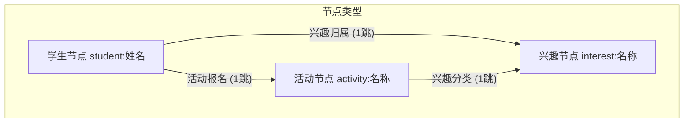

# 🧭 Campus Buddy: 校园社交拓扑网络与智能匹配系统

`Campus Buddy` 是一个基于图数据结构（Graph Data Structure）的高性能校园社交与活动匹配推荐系统。本项目支持 **1,500+ 学生、30 种兴趣标签、100 个校园活动**的大规模数据关联，提供命令行 MVP 工具与基于 **Vue 3 + D3.js** 开发的极客霓虹感（Sleek Slate & Neon）现代化可视化 Web 交互面板。

项目完全适配 **GitHub Pages 静态托管**（采用纯前端图算法逻辑与本地会话持久化），并为学术报告和工程演示编写了详尽的设计文档。

---

## 📖 设计思路与算法架构

本项目的核心是一个**异构无向图（Heterogeneous Undirected Graph）**。在普通的同构图中，节点类型单一（如全是人）。而在 `Campus Buddy` 中，图的节点分为三种类型，通过不同的关联边编织成网：



### 1. 核心图算法设计

* **双跳路径穿透推荐（2-Hop BFS Recommendations）**：
  * **活动匹配**：从给定学生节点出发，搜索其关联的所有兴趣节点（1跳），再由兴趣节点搜索关联的所有校园活动（2跳）。其路径为 `Student -> Interest -> Activity`，返回去重并按字母排序的推荐活动列表。
  * **搭子匹配**：同样通过两步搜索，寻找拥有共同兴趣的其他同学：`Student -> Interest -> Other Student`，排除学生自身。
* **社交路径穿透（协同过滤式匹配理由）**：
  * 为了避免单一的“根据兴趣推活动”显得生硬、勉强，系统实现了社交协同匹配：
    $$Path(S \to I \to S' \to A)$$
    如果你的活动搭子（共享兴趣的同学 $S'$）已经报名了活动 $A$，系统会在活动卡片上展示友情提示：`👥 搭子情况: 小刚 等人也报名了该活动`。这种 3-Hop 的深度关联大大提升了社交推荐的自然度与真实感。
* **连通社区划分（Connected Components using BFS）**：
  * 系统使用广度优先搜索（BFS）算法遍历全图，识别出图中的所有极大连通子图（即相互独立、没有交集的兴趣小圈子）。这有助于学校管理员分析校园社交孤岛，优化活动资源分配。

### 2. 纯前端图仿真设计 (GitHub Pages 适配)
* 传统的 Web 应用通常将图存储在后端数据库（如 Neo4j），但为了实现**零服务器运维、即开即用的静态页面部署（GitHub Pages）**，本项目将图的创建、BFS 双跳算法以及连通圈计算**完整移植到了前端 JavaScript (TypeScript)**。
* 启动时，前端会加载通过 Python 编译的静态 JSON 数据库 `graph_data.json`；当用户进行“模拟登入”或“沙盒调试”时，新生成的节点与边将保存在浏览器本地（`localStorage`）中，实现无后端的实时增量仿真。

### 3. 可视化性能优化 (Focal Subgraph)
* **面临挑战**：直接在网页 SVG 中用 D3.js 力导向图渲染 1,500+ 个节点和近千条边，会导致浏览器发生严重卡顿甚至崩溃。
* **解决方案**：引入 **Ego Network（自我聚焦子图）** 概念。
  * 当未选择特定学生时，仅展示核心的兴趣圈概览图。
  * 当选中某个学生时，D3 引擎仅抓取该生周围的 **2跳聚焦子图**（包含该学生、其选择 of 2-4 个兴趣、这些兴趣关联的活动以及几位核心搭子），节点数量控制在 15~35 个。
  * 同时，将搭子的报名关系绘制为**紫色虚线**，将当前用户的一键报名绘制为**青色实线**，确保 60FPS 丝滑的拖拽与缩放体验。

---

## 📁 项目文件结构

```bash
week13_campus_buddy/
├── .gitignore                    # Git 忽略文件（忽略依赖、构建产物与大型数据）
├── README.md                     # 本说明文档
├── campus_buddy.py               # Python 算法核心（定义 CampusBuddyGraph 类）
├── demo_runner.py                # Python 经典 MVP 演示入口（控制台输出）
├── interactive_app.py            # Python 命令行交互式数据检索系统
├── test_campus_buddy.py          # Pytest 单元测试（包含极限规模下 < 5ms 的延迟测试）
├── generate_mock_data.py         # 模拟数据生成器（生成 1500 学生、30 兴趣、100 活动、1500 报名）
├── export_graph_to_json.py       # 数据导出器（将 CSV 数据转化为前端 JSON 数据库）
└── frontend/                     # Vue 3 极客网页端源码
    ├── public/
    │   └── graph_data.json       # 供前端加载的静态图数据
    ├── src/
    │   ├── App.vue               # 主页面（包含 Survery 登入、推荐看板、D3.js 力导向画布）
    │   ├── main.ts               # 项目入口
    │   └── style.css             # 全局 Slate & Neon 霓虹渐变 CSS 设计系统
    ├── package.json              # 依赖与编译脚本
    └── vite.config.ts            # Vite 配置文件
```

---

## 🛠️ 使用手册 & 运行指南

### 前置条件
确保您的系统安装了以下环境：
* **Python 3.8+** (推荐安装 `pytest` 进行测试)
* **Node.js 18+** 与 **npm** (用于运行网页端)

---

### 第一步：克隆并生成大规模图数据
在项目根目录下打开终端，依次运行 Python 脚本生成 1,500+ 学生规模的模拟数据集，并导出为 JSON：

```bash
# 1. 生成 1500 名学生、30 个兴趣分类、100 个校园活动、1515 条报名边的模拟 CSV 数据
python generate_mock_data.py

# 2. 将 CSV 数据打包并导出为前端可加载的静态 JSON 数据库
python export_graph_to_json.py
```

*生成成功后，会在项目下创建 `data/` 目录，并在 `frontend/public/` 下生成 `graph_data.json`。*

---

### 第二步：运行 Python 端演示与测试
如果您想在控制台验证图算法的正确性：

```bash
# 1. 运行经典的图遍历路径输出演示
python demo_runner.py

# 2. 启动命令行下的交互式Campus Buddy查询系统
python interactive_app.py

# 3. 运行自动化单元测试（验证 BFS 逻辑、命名防冲突，以及极限规模下的算法延迟检测）
pytest test_campus_buddy.py
```

*极限性能测试会检测 2 跳推荐的响应时间，在 1,500+ 节点网络中，单次图查询延迟严格小于 **5毫秒**。*

---

### 第三步：启动 Vue 3 霓虹网页端
进入前端目录，安装依赖并启动本地开发服务器：

```bash
# 进入前端文件夹
cd frontend

# 安装 D3.js、Vue 3 和 Vite 等依赖
npm install

# 启动本地预览服务器 (默认端口 http://localhost:4173)
npm run preview
```

在浏览器中打开命令行提示的地址（如 `http://localhost:4173` 或控制台给出的端口），即可进入交互系统。

---

## 🖥️ 网页端交互与选校功能指南

1. **模拟登入与画像构建 (Mock Login & Survey)**
   * 启动网页后，会弹出一个黑客暗色霓虹风格的登录卡片。
   * 输入您的姓名（如：`张伟`），并在下方**折叠面板中自主勾选**您的兴趣爱好（支持多选，分运动、艺术、技术、社交四大类）。
   * 点击 `生成画像并登入`，系统会即时将您的数据写入到拓扑网络中，并自动计算出您在当前网络中的位置。
2. **分类与按需展示推荐 (Interest Filter Tabs)**
   * 系统顶端会显示您个人的兴趣标签栏（例如：`🌟 全部推荐`、`机器学习`、`羽毛球`）。
   * **自主选择**：点击不同的标签，下方的匹配推荐会即时响应过滤，避免信息过载。
   * **折叠限制**：为了防止活动列表刷屏，每个兴趣模块默认只展示 **3 个最佳匹配活动**。点击 `+ 展开其余活动` 可滑动查看全部，点击 `一键报名` 可即时参与并更新主页卡片。
3. **社交网络沙盒调试器 (Sandbox Tool)**
   * 在左下角的 **“动态调试网络”** 面板中，您可以随时手动录入新学生或新活动（如注册一个新学生“李雷”喜欢“Go编程”），右侧的 D3 拓扑图与推荐数据会立刻无缝更新。
4. **D3.js 局域关联拓扑网络 (Interactive Canvas)**
   * 鼠标滚动：支持关系网的无限缩放与平移。
   * 节点拖拽：拖拽任意节点可看清与其他关联边的张力，双击或单击同学节点可直接切换当前查询视角。
